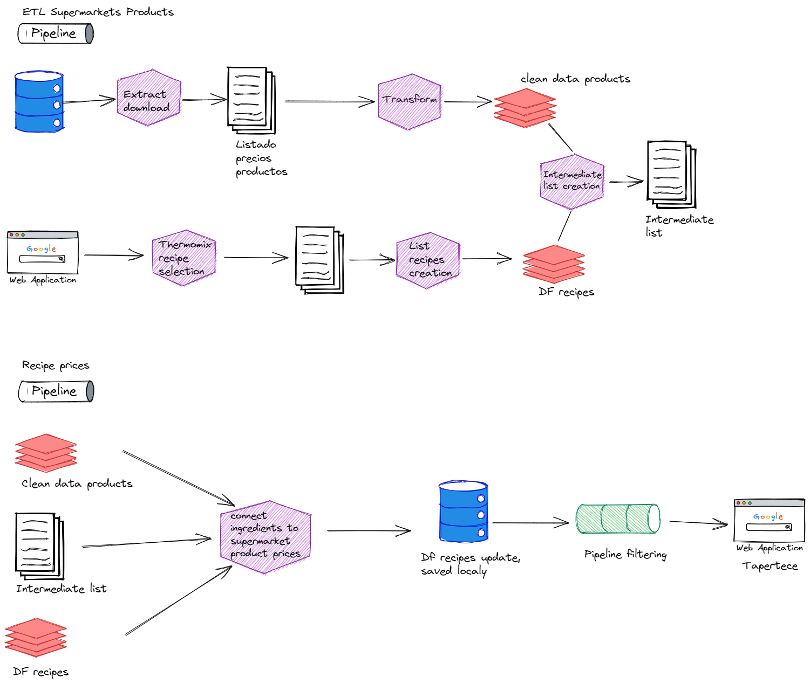

# proyecto_final
# TAPERTECE

## Tapertece:
Aplicación que parsea recetas de un robot de cocina identificando ingredientes y gramajes para cruzarlo con un dataset, obtenido de una base de datos que ha sido tratado y transformado, de productos de alimentos de tres marcas de supermercados para obtener el coste de los ingredientes utilizados en dicha receta

## Structure:

